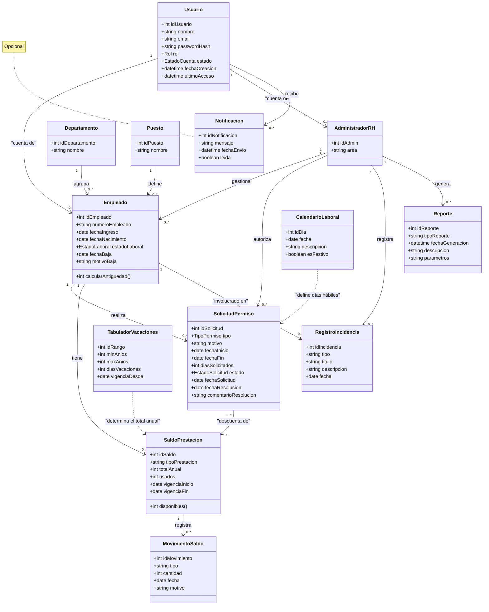

```mermaid
classDiagram
    class Usuario {
        +int idUsuario
        +string nombre
        +string email
        +string passwordHash
        +Rol rol
        +EstadoCuenta estado
        +datetime fechaCreacion
        +datetime ultimoAcceso
    }

    class Empleado {
        +int idEmpleado
        +string numeroEmpleado
        +date fechaIngreso
        +date fechaNacimiento
        +EstadoLaboral estadoLaboral
        +date fechaBaja
        +string motivoBaja
        +int calcularAntiguedad()
    }

    class AdministradorRH {
        +int idAdmin
        +string area
    }

    class Departamento {
        +int idDepartamento
        +string nombre
    }

    class Puesto {
        +int idPuesto
        +string nombre
    }

    class SolicitudPermiso {
        +int idSolicitud
        +TipoPermiso tipo
        +string motivo
        +date fechaInicio
        +date fechaFin
        +int diasSolicitados
        +EstadoSolicitud estado
        +date fechaSolicitud
        +date fechaResolucion
        +string comentarioResolucion
    }

    class SaldoPrestacion {
        +int idSaldo
        +string tipoPrestacion
        +int totalAnual
        +int usados
        +date vigenciaInicio
        +date vigenciaFin
        +int disponibles()
    }

    class MovimientoSaldo {
        +int idMovimiento
        +string tipo
        +int cantidad
        +date fecha
        +string motivo
    }

    class TabuladorVacaciones {
        +int idRango
        +int minAnios
        +int maxAnios
        +int diasVacaciones
        +date vigenciaDesde
    }

    class RegistroIncidencia {
        +int idIncidencia
        +string tipo
        +string titulo
        +string descripcion
        +date fecha
    }

    class Reporte {
        +int idReporte
        +string tipoReporte
        +datetime fechaGeneracion
        +string descripcion
        +string parametros
    }

    class CalendarioLaboral {
        +int idDia
        +date fecha
        +string descripcion
        +boolean esFestivo
    }

    class Notificacion {
        +int idNotificacion
        +string mensaje
        +datetime fechaEnvio
        +boolean leida
    }

    note for Notificacion "Opcional"

    Usuario "1" --> "0..1" Empleado : "cuenta de"
    Usuario "1" --> "0..1" AdministradorRH : "cuenta de"
    AdministradorRH "1" --> "0..*" Empleado : gestiona
    Departamento "1" --> "0..*" Empleado : agrupa
    Puesto "1" --> "0..*" Empleado : define
    Empleado "1" --> "0..*" SolicitudPermiso : realiza
    Empleado "1" --> "0..*" SaldoPrestacion : tiene
    SolicitudPermiso "0..*" --> "1" SaldoPrestacion : "descuenta de"
    SaldoPrestacion "1" --> "0..*" MovimientoSaldo : registra
    AdministradorRH "1" --> "0..*" SolicitudPermiso : autoriza
    AdministradorRH "1" --> "0..*" RegistroIncidencia : registra
    Empleado "1" --> "0..*" RegistroIncidencia : "involucrado en"
    AdministradorRH "1" --> "0..*" Reporte : genera
    Usuario "1" --> "0..*" Notificacion : recibe
    TabuladorVacaciones ..> SaldoPrestacion : "determina el total anual"
    CalendarioLaboral ..> SolicitudPermiso : "define días hábiles"
```
